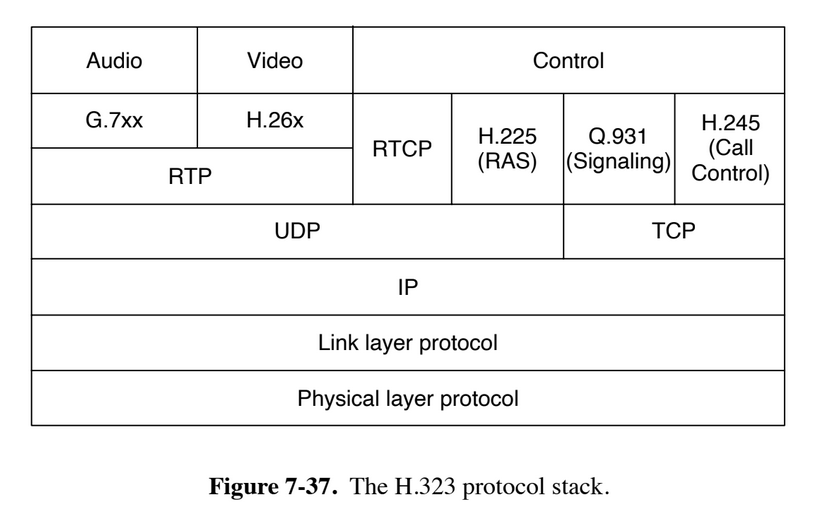

- Buffering decouples media plya/stream rate from download rate. This also lets TCP do its thing
- Scrubbing really fucks with the decoding process when you don't stop on a magic frame
- Good encoding I frames depends on your network quality
- "Internet Datacenter" used to be a thing
- CDNs -> users got faster web sites, ISPs got money from providers, providers got more customers; everyone "won"
- The reason CDNs offer DNS servers is for better load balancing
- Fig. 7-37 is why we can't have nice things

